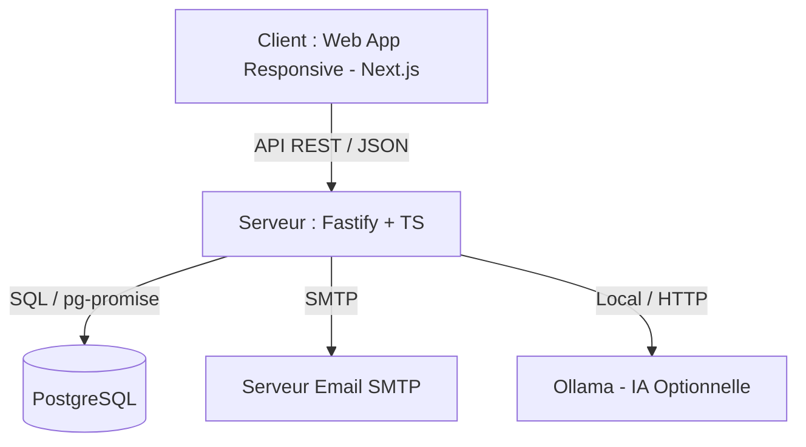

# Design Doc (Phase 0) — QSE Studio

Ce document définit les fondations architecturales et techniques de **QSE Studio**. Il doit être validé par l'utilisateur avant d'écrire le code ou le plan d'exécution.

---

## 1. Architecture des composants

L'application est conçue pour être modulaire, simple et robuste (zéro dépendance externe inutile). Elle adopte une architecture monolithique modulaire avec un Frontend Next.js communiquant avec un serveur Backend Node.js en API REST.



### Modules Applicatifs principaux

*   **`web-client` (Frontend)** :
    *   Interface utilisateur épurée et moderne, optimisée pour le terrain (mobile-friendly).
    *   Composants réutilisables (Formulaires de saisie, Kanban, Graphiques de tendances).
    *   Gestion locale de l'état UI et des caches d'API.
*   **`api-server` (Backend)** :
    *   Gestion des routes REST (Fastify).
    *   Validation stricte des schémas d'entrée/sortie (TypeBox ou Zod).
    *   Authentification (Session ou JWT léger persisté par cookie HTTP-only).
    *   Service de notification (envoi d'e-mails pour l'assignation et les retards).
    *   Service d'export PDF (via Puppeteer ou PDFKit).
*   **`database` (PostgreSQL)** :
    *   Stockage relationnel classique.
    *   Schéma structuré avec intégrité référentielle forte.

---

## 2. Contrats de données (Interfaces)

Le modèle relationnel garantit la cohérence des données sans compromis. Voici la structure cible des tables de données principales pour le MVP (Non-Conformités & CAPA).

### Structures SQL principales

```sql
-- Énumérations
CREATE TYPE user_role AS ENUM ('admin', 'qse', 'collaborateur');
CREATE TYPE nc_status AS ENUM ('draft', 'open', 'analyzed', 'closed');
CREATE TYPE action_status AS ENUM ('todo', 'in_progress', 'done', 'cancelled');
CREATE TYPE severity_level AS ENUM ('minor', 'major', 'critical');

-- Table des Utilisateurs
CREATE TABLE users (
    id UUID PRIMARY KEY DEFAULT gen_random_uuid(),
    email VARCHAR(255) UNIQUE NOT NULL,
    password_hash VARCHAR(255) NOT NULL,
    first_name VARCHAR(100) NOT NULL,
    last_name VARCHAR(100) NOT NULL,
    role user_role NOT NULL DEFAULT 'collaborateur',
    created_at TIMESTAMP WITH TIME ZONE DEFAULT CURRENT_TIMESTAMP,
    updated_at TIMESTAMP WITH TIME ZONE DEFAULT CURRENT_TIMESTAMP
);

-- Table des Fiches de Non-Conformité (NC)
CREATE TABLE non_conformities (
    id UUID PRIMARY KEY DEFAULT gen_random_uuid(),
    title VARCHAR(150) NOT NULL,
    description TEXT NOT NULL,
    status nc_status NOT NULL DEFAULT 'draft',
    severity severity_level NOT NULL DEFAULT 'minor',
    reporter_id UUID NOT NULL REFERENCES users(id),
    qse_manager_id UUID REFERENCES users(id),
    detected_at TIMESTAMP WITH TIME ZONE NOT NULL,
    created_at TIMESTAMP WITH TIME ZONE DEFAULT CURRENT_TIMESTAMP,
    updated_at TIMESTAMP WITH TIME ZONE DEFAULT CURRENT_TIMESTAMP,
    
    -- Analyse des causes (5 Pourquoi)
    why_1 VARCHAR(255),
    why_2 VARCHAR(255),
    why_3 VARCHAR(255),
    why_4 VARCHAR(255),
    why_5 VARCHAR(255),
    root_cause TEXT,
    ishikawa_category VARCHAR(50) -- 'Matière', 'Matériel', 'Méthode', 'Main d'oeuvre', 'Milieu'
);

-- Table des Actions Correctives et Préventives (CAPA)
CREATE TABLE capa_actions (
    id UUID PRIMARY KEY DEFAULT gen_random_uuid(),
    nc_id UUID NOT NULL REFERENCES non_conformities(id) ON DELETE CASCADE,
    title VARCHAR(150) NOT NULL,
    description TEXT NOT NULL,
    status action_status NOT NULL DEFAULT 'todo',
    assignee_id UUID NOT NULL REFERENCES users(id),
    due_date DATE NOT NULL,
    completed_at TIMESTAMP WITH TIME ZONE,
    created_at TIMESTAMP WITH TIME ZONE DEFAULT CURRENT_TIMESTAMP,
    updated_at TIMESTAMP WITH TIME ZONE DEFAULT CURRENT_TIMESTAMP
);
```

---

## 3. Gestion de l'état (State Management)

*   **Persistance de l'état système** : PostgreSQL sert de source unique de vérité.
*   **Authentification et Session** :
    *   Jeton stocké dans un cookie HTTP-Only pour sécuriser les requêtes sans risque XSS.
    *   Authentification sans état (JWT ou jetons de session en cache mémoire Redis/Memory-Store pour débuter simple).
*   **Frontend (Next.js)** :
    *   Utilisation de React Query (ou SWR) pour le cache réseau des requêtes et la synchronisation avec le serveur.
    *   État local d'UI (comme l'édition d'Ishikawa ou les formulaires multipasses) stocké dans le state React natif (`useState`/`useReducer`).

---

## 4. Arborescence cible du projet

Le projet sera entièrement structuré dans le dossier `/open-source-projects/qse-studio/` :

```
qse-studio/
├── README.md                     # Vision et documentation générale
├── LICENSE                       # Licence AGPL-3.0
├── docker-compose.yml            # Orchestration pour le déploiement local / prod
├── .env.example                  # Modèle des variables d'environnement (SMTP, DB)
├── docs/
│   └── design-doc.md             # Ce document de conception
├── api-server/                   # API Node.js/Fastify
│   ├── package.json
│   ├── tsconfig.json
│   ├── src/
│   │   ├── index.ts              # Point d'entrée serveur
│   │   ├── config.ts             # Configuration (variables d'env)
│   │   ├── db.ts                 # Connexion PostgreSQL
│   │   ├── routes/               # Contrôleurs et routes
│   │   │   ├── auth.ts
│   │   │   ├── nc.ts
│   │   │   └── actions.ts
│   │   ├── services/             # Logique métier et outils
│   │   │   ├── mail.ts           # Service de notification SMTP
│   │   │   └── pdf.ts            # Service d'export PDF
│   │   └── schemas/              # Schémas de validation TypeBox / TS Types
│   └── db/
│       └── migrations/           # Scripts de création de base de données
└── web-client/                   # Application Frontend Next.js
    ├── package.json
    ├── tailwind.config.js        # Optionnel pour l'esthétique si choisi, ou pure CSS
    ├── src/
    │   ├── app/                  # Router Next.js (App Router)
    │   │   ├── page.tsx          # Page de dashboard
    │   │   ├── layout.tsx
    │   │   ├── nc/               # Gestion des non-conformités
    │   │   │   ├── [id]/page.tsx # Détail de la NC & Ishikawa
    │   │   │   └── new/page.tsx  # Création
    │   │   └── login/page.tsx
    │   ├── components/           # Composants réutilisables (Kanban, Ishikawa)
    │   ├── hooks/                # Custom React Hooks (React Query)
    │   └── utils/
```
